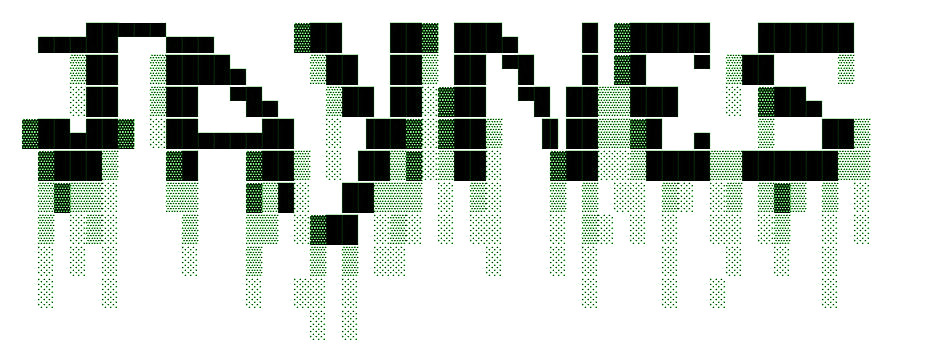

 

Heavily inspired by <a href="https://probcomp.github.io/Gen/">Gen.jl</a> and <a href="https://github.com/MikeInnes/Poirot.jl">Poirot.jl</a>: <i>Jaynes</i> is a minimal trace-based PPL but includes the usage of IR manipulations for non-standard interpretation and analysis, which may help by providing information which can be used during inference programming.

This might allow us to do cool things like:
1. Grab the dependency graph of a probabilistic program as a static pass and analyze it!
2. Possibly store analysis meta-data for inference programming (i.e. sub-graphs with exponential conjugacy can be identified).
3. Belief propagation and trace-based inference in one PPL like whaaaaaaaaaa

Work in progress :)

---
Update: 02/28/20

As a first little experiment, I wrote the core of a deep neural network inference compiler. Using IR transformations, I'm working on automatically compiling a probabilistic program into an inference compiled proposal program.

