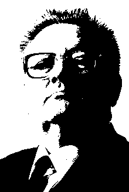

<p align="center">

</p>
<br>

_Jaynes_ is a probabilistic programming framework which uses IR transformations and contextual dispatch to implement the core routines for modeling and inference.

Currently, _Jaynes_ supports a dynamic modeling DSL which is syntactically close (and semantically equivalent) to the dynamic DSL in [Gen](https://www.gen.dev/). This comes with a few caveats:

1. It is _partially optimized_. I've chosen representations which minimize allocations via profiling - but there are still upstream issues which affect performance on certain programs.
2. There are a few _effects_ in the library (which are semantically similar to Gen's combinators) but their implementation via contextual dispatch is not complete nor stable. This will likely improve with time, as I settle on representations which allow the sort of analysis I'm aiming for (as noted below).
3. There are few performance guarantees. Because this package relies on `Cassette`, it comes with all the subtle type performance issues that `Cassette` comes with.

Currently supported inference algorithms for this DSL:
- [X] Importance sampling
- [ ] Programmable MCMC
- [ ] HMC
- [ ] Metropolis-Hastings
- [X] Particle filtering
- [X] Inference compilation (training pipeline complete, now interfaces to use trained network need to be built)
- [X] Gradient-based methods (fundamental infrastructure is working, BBVI not in yet)

The dynamic DSL is not the main feature of this system. Gen's version is better optimized, easier to use, and has a better assortment of inference algorithms. _Jaynes_ aims to support a restricted _graph-based_ DSL which allows the user to utilize graphical model inference algorithms. Ideally, _Jaynes_ should be able to identify when a program is amenable to this static representation. This is a WIP, and requires a bit more research at the IR level. The goal for this DSL is to seamlessly combine with the dynamic, sample-based DSL in a productive way.

## Extending _Jaynes_

_Jaynes_ is equipped with the ability to extend the tracing interface to black-box code. This is naturally facilitated by the metaprogramming capabilities of `Cassette`. The primary usage of this extension is to define new `logpdf` method definitions for code which may contain sources of randomness which are not annotated with addresses and/or where inspection by the tracing mechanism can be safely abstracted over. Note that there is no explicit check that the `logpdf` you write is a valid one.

The following example shows how this extension mechanism works.

```julia
function foo1(y::Float64)
    return y
end

@primitive function logpdf(fn::typeof(foo1), y::Float64)
    if y < 1.0
        log(1) 
    else
        -Inf
    end
end

function bar(z::Float64)
    y = rand(:y, foo1, (z, ))
    return y
end

ctx = Generate(Trace())
ret = trace(ctx, bar, (0.3, ))
display(ctx.metadata.tr)

#  __________________________________
#
#               Playback
#
# y
#          val  = 0.3
#
#  __________________________________
#
# score : 0.0
#
#  __________________________________
```

`@primitive` requires that the user define a `logpdf` definition for the call. This expands into `overdub` method definitions for the tracer which automatically work with all the core library context/metadata dispatch.

## Other notes

The motivation for this project is to identify interfaces and techniques to combine programmable inference with graphical model inference. These techniques have complementary strengths and weaknesses - programmable sampling algorithms tend to have difficulties in high-dimensions (but can answer joint queries about a model efficiently when they are efficient) whereas the asymptotic complexity of graphical model algorithms is typically not dependent on the dimensionality of the model (and instead depends on the topology of the dependence graph) but queries are typically restricted to be marginal queries.

## Examples

```julia
module Geometric

include("../src/Jaynes.jl")
using .Jaynes
using Distributions

geo(p::Float64) = rand(:flip, Bernoulli, (p, )) == 1 ? 0 : 1 + rand(:geo, geo, p)

tr, score = trace(geo, (0.3, ))
display(tr)

end # module

#  __________________________________
#
#               Playback
#
# :geo => :flip
#          val  = 0
#
# flip
#          val  = 0
#
# :geo => (:geo => :flip)
#          val  = 1
#
#  __________________________________
#
# score : 0.0
#
# func : typeof(Main.Geometric.geo)
#
# args : Tuple{Float64}
#
# retval : 2
#
#  __________________________________
```

## Acknowledgements

The ideas which are going into this package would not have been possible without numerous conversations with very smart people in the Julia community and beyond. I would like to acknowledge the following people

> Jarred Barber, Alex Lew, Marco Cusumano-Towner, Ben Sherman, Jarrett Revels, Valentin Churavy, George Matheos, Chad Scherrer, Martin Trapp, Philipp Gabler, Lyndon White, Mike Innes, and Ari Katz...amongst many others in the probabilistic programming community.

as well as the following systems

> [Gen](https://github.com/probcomp/Gen.jl), [Turing](https://github.com/TuringLang/Turing.jl), [Soss](https://github.com/cscherrer/Soss.jl), [Pyro](https://pyro.ai/), [Unison](https://www.unisonweb.org/), [Cassette](https://github.com/jrevels/Cassette.jl) and [Zygote](https://github.com/FluxML/Zygote.jl).


---
