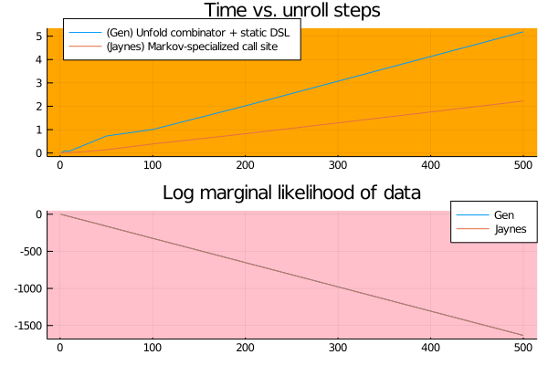

# Particle filtering in hidden Markov models

This benchmark is a single-shot time comparison between `Gen` and `Jaynes`. [The source for this benchmark is available here.](https://github.com/femtomc/JaynesBenchmarks)

```@raw html
<div style="text-align:center">
    
</div>
```

which compute the same log marginal likelihood of the data.
