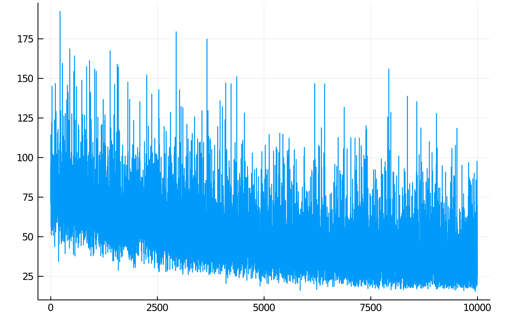

Jaynes contains a number of components which utilize or allow for _differential programming_. At the highest level, learnable parameters can be declared by passing literals into `rand` calls. These declarations are not used in contexts parametrized by inference and tracing metadata, but have a special interpretation in contexts parametrized by `GradientMeta` instances.

### Learnable parameters

```julia
# Literals are tracked as trainable.
x = rand(:x, 10.0)
t = rand(:t, 7.0)
```

This informally represents a sort of delta distribution with initial parameter equal to the literal. You might imagine constructing a program `foo1` with learnable parameters:

```julia
function foo1()
    # Literals are tracked as trainable.
    x = rand(:x, 10.0)
    t = rand(:t, 7.0)
    cat_p = rand(:cat_p, 0.2)

    # Rand calls on distributions also get tracked and the dependency graph is created.
    y = rand(:y, Normal, (x, 1.0))
    z = rand(:z, Normal, (t, 3.0))
    cat = rand(:cat, Categorical, ([cat_p, 1 - cat_p], ))
    for i in 1:10
        if cat == 1
            q = rand(:q => i, Normal, (5.0, 1.0))
        else
            q = rand(:q => i, Normal, (8.0, 1.0))
        end
    end
    return z
end
```

The natural objective is the `logpdf` of a trace over the execution of this program. We might generate traces from another program, and perform gradient-based learning to maximize the `logpdf` of the model program with learnable parameters.

```julia
function foo2()
    x = rand(:x, 1.0)
    y = rand(:y, Normal, (x, 1.0))
    z = rand(:z, Normal, (x + 10, 13.0))
    cat = rand(:cat, Categorical, ([0.5, 0.5],))
    for i in 1:10
        if cat == 1
            q = rand(:q => i, Normal, (5.0, 1.0))
        else
            q = rand(:q => i, Normal, (10.0, 1.0))
        end
    end
    return z
end
```

We can generate a batch of traces from the target `foo2`:

```julia
ctx, trs, _, _ = importance_sampling(foo2, (), 10000)
```

Jaynes supports [Flux](https://github.com/FluxML/Flux.jl)-style learning APIs:

```julia
trained_ctx, losses = train!(ADAM(), foo1, (), trs)
plt = plot(losses, legend=:false)
display(plt)
```



!!! warning
    Despite the fact that this seems like a _batch_ training step with batch `trs` - the optimization is performed on a trace by trace basis, because traces can have different shapes. 

    There are methodologies to allow for vectorized batching of traces (i.e. when the modeling language is restricted, so that the call graph of the program is constant over traces) but they are not yet enabled in the library.

Here, after training, the resultant parameter values are stored in `trained_ctx.metadata.trainable` which is a map from `Address` to values. These values can be extracted and used in other contexts - the contextual execution of any program which includes addressed `rand` calls with literals will check the context for `trainable` metadata and return if the address matches a key.

### Inference compilation

One powerful inference feature allowed by the differentiable programming capabilities available in Julia is the creation of _inference compilers_ automatically on a program by program basis. Inference compilers are neural network architectures which are trained to produce proposal distributions for sequential sampling-based inference engines.
